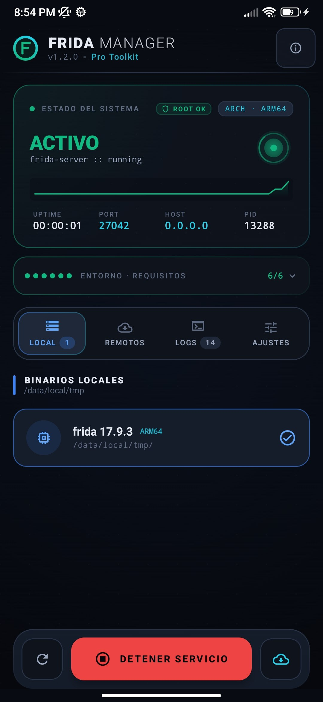
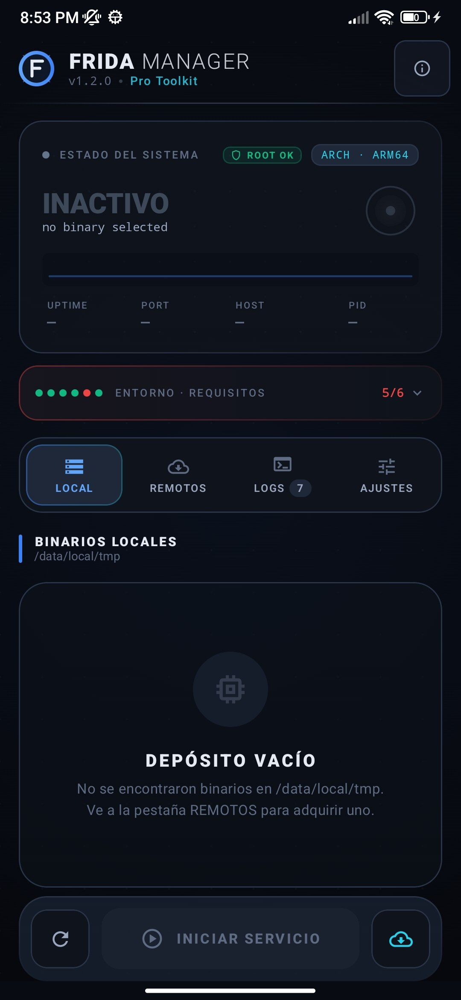
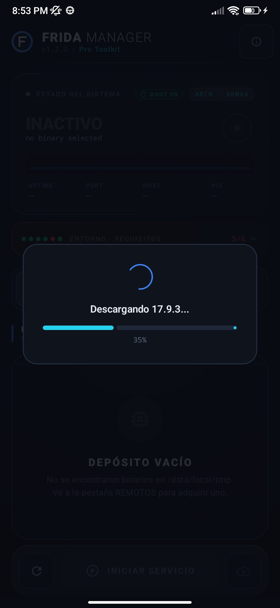
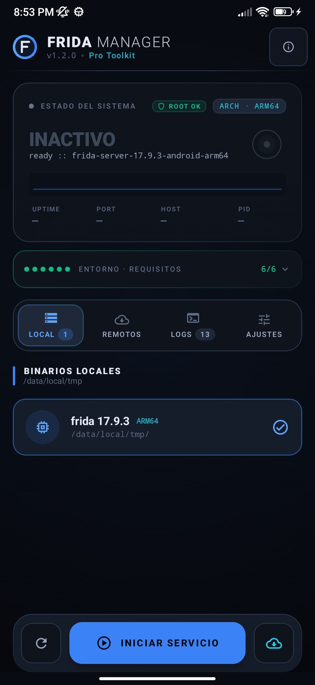
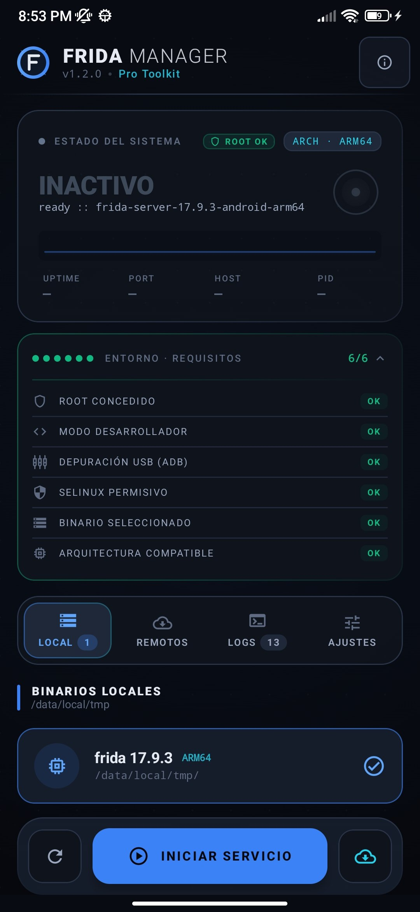
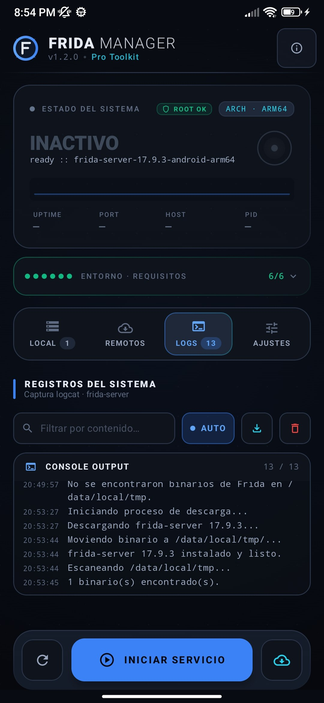

<div align="center">



# Frida Manager
### Pro Toolkit for Android — v1.2.0

**The simplest way to run Frida Server on your rooted Android device.**  
No commands. No terminal. Just tap.

[](../../releases/latest)
[](../../releases)
[](#requisitos)
[](LICENSE)

</div>

---

## ¿Qué es esto?

Si alguna vez has trabajado con **Frida** sabes que el ciclo de siempre es el mismo:

1. Conectar el teléfono por USB
2. Abrir una terminal
3. Escribir `adb push frida-server /data/local/tmp/`
4. Escribir `adb shell chmod 755 /data/local/tmp/frida-server`
5. Escribir `adb shell su -c "/data/local/tmp/frida-server &"`
6. Esperar a que arranque
7. Rezar para que SELinux no lo mate

**Frida Manager** elimina todo eso.

Es una app Android que vive en tu propio dispositivo y te permite gestionar, descargar y arrancar Frida Server con un solo toque, sin abrir una terminal, sin recordar rutas ni comandos, con una interfaz que te dice exactamente qué está pasando en todo momento.

---

## ¿Para quién es?

- Investigadores de seguridad móvil que trabajan con Frida frecuentemente
- Pentesters que necesitan levantar el servidor de forma rápida entre pruebas
- Desarrolladores que usan Frida para analizar el comportamiento de sus propias apps
- Cualquiera que esté aprendiendo análisis dinámico y no quiera pelear con la terminal

---

## ¿Qué hace?

### Un vistazo rápido al estado del sistema
En cuanto abres la app sabes si Frida está corriendo o no — uptime, PID, puerto, arquitectura del dispositivo. Todo visible de inmediato.

### Descarga automática desde GitHub
Frida Manager consulta el repositorio oficial de Frida y descarga la versión correcta para tu arquitectura (ARM64, ARM, x86…) directamente a tu teléfono. Sin buscar releases manualmente.

### Gestión de binarios locales
Los binarios que tengas en `/data/local/tmp` aparecen automáticamente en la lista. Seleccionas el que quieres usar y listo.

### Checker de requisitos del entorno
Antes de que intentes lanzar Frida, la app revisa todo lo que necesita estar en orden: root, modo desarrollador, depuración USB, SELinux, que el binario coincida con tu CPU. Si algo falta, te dice qué es y cómo arreglarlo.

### Logs en tiempo real
Captura la salida de logcat filtrada por frida-server para que veas exactamente qué está pasando. Con búsqueda, filtro por nivel y exportación.

### Ajustes para dispositivos difíciles
Toggle de SELinux Permisivo, Samsung Turbo-Fix (desactiva USAP + SELinux en un toque) y configuración de puerto/dirección de escucha.

---

## Capturas de pantalla

<div align="center">

| Pantalla principal | Descarga en progreso |
|:--:|:--:|
|  |  |
| Estado del sistema, checker de entorno y binarios locales | Descarga automática del release oficial desde GitHub |

| Binario detectado | Requisitos completos |
|:--:|:--:|
|  |  |
| frida-server 17.9.3 ARM64 listo para iniciar | Los 6 checks en verde — entorno 100% listo |

| Logs del sistema | Servicio activo |
|:--:|:--:|
|  |  |
| Salida en tiempo real con timestamp y filtros | Frida Server corriendo — PID, puerto y uptime en vivo |

</div>

---

## Requisitos

Para usar Frida Manager necesitas:

- **Android 8.0 o superior**
- **Root** (Magisk, KernelSU o similar)
- **Modo Desarrollador** activado en tu dispositivo
- **Depuración USB** habilitada (para poder conectarte con Frida desde la PC)
- Conexión a internet para descargar la primera vez

> La app detecta automáticamente si alguno de estos requisitos falta y te guía para solucionarlo.

---

## Cómo empezar

1. Descarga el APK desde la sección [**Releases**](../../releases/latest)
2. Instálalo en tu dispositivo rooteado
3. Concede permisos de root cuando se soliciten
4. Pulsa el botón **↓** para descargar la última versión de frida-server
5. Selecciona el binario descargado en la pestaña **LOCALES**
6. Pulsa **INICIAR SERVICIO**
7. Conéctate desde tu PC con `frida-ps -H <IP_DEL_DISPOSITIVO>`

---

## Releases

Cada release incluye:

- APK listo para instalar (debug y release)
- Notas de cambios de esa versión
- Versión mínima de Android requerida

👉 [Ver todos los releases](../../releases)

El changelog de cada versión está disponible directamente en GitHub junto al APK correspondiente.

---

## ¿Puedo ayudar a mejorar la app?

¡Claro que sí! Este proyecto está abierto a cualquiera que quiera contribuir, sin importar tu nivel.

### Ideas para contribuir

- 🐛 **Encontraste un bug** → Abre un [Issue](../../issues) describiendo qué pasó y en qué dispositivo
- 💡 **Tienes una idea** → Abre un Issue con la etiqueta `enhancement` y cuéntanos qué mejoraría tu flujo de trabajo
- 🔧 **Quieres escribir código** → Haz un fork, crea una rama con tu cambio y abre un Pull Request
- 📱 **Probaste en un dispositivo específico** → Comparte tu experiencia en Issues — saber qué funciona (y qué no) en distintos fabricantes es muy valioso
- 📖 **Quieres mejorar la documentación** → Este README, las instrucciones, las traducciones — todo suma

### ¿Cómo contribuir con código?

```
1. Fork del repositorio
2. git checkout -b feature/mi-mejora
3. Haz tus cambios
4. git commit -m "feat: descripción breve"
5. git push origin feature/mi-mejora
6. Abre un Pull Request
```

No hay reglas complicadas. Si tu cambio mejora la app, bienvenido es.

---

## Aviso legal

Este proyecto es de uso educativo y para investigación de seguridad legítima. El uso de Frida para analizar aplicaciones de terceros sin autorización puede ser ilegal dependiendo de tu país. Eres responsable del uso que hagas de esta herramienta.

Frida Manager no está afiliado ni endorsado por el proyecto Frida.

---

<div align="center">

Hecho con mucho café por **J41K**

[⭐ Dale una estrella si te es útil](../../stargazers) · [🐛 Reportar un bug](../../issues/new) · [📦 Ver releases](../../releases)

</div>
